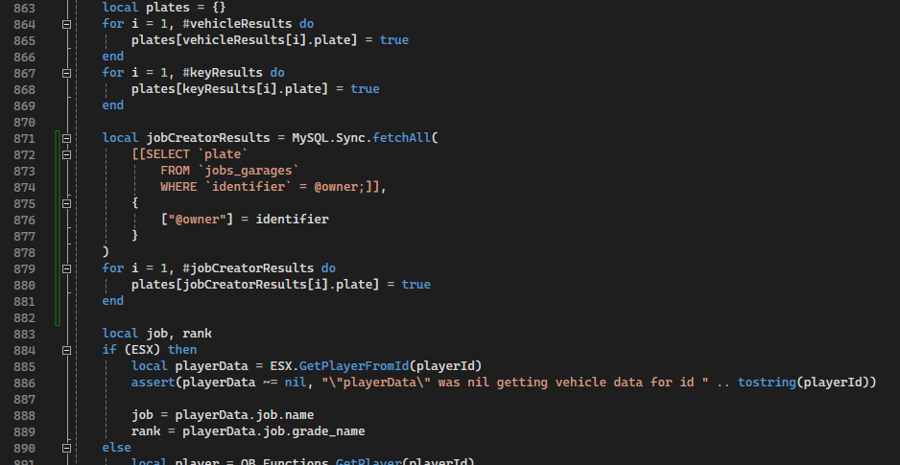

# FAQ

## Explanation for controls / key mappings

The default controls are defined at the bottom of the config. You have a few possibilities here:

* Change primary bindings by changing inputType and key.
* Change secondary bindings by changing altInputType and altKey.
* Remove a control entirely by commenting the whole section.
* Remove only the secondary bindings by just commenting the altInputType and altKey lines.

Available input types and bindings can be found here:<br>
[https://docs.fivem.net/docs/game-references/input-mapper-parameter-ids/](https://docs.fivem.net/docs/game-references/input-mapper-parameter-ids/)

If you already started the resource and connected to the server once and then you decide to change 
the bindings, you will also have to do so ingame in the keybinding settings in the FiveM category. 
This also allows setting custom bindings for players.

***

## Keys as Items

<font style="color:red;">**Tl'dr:**</font>

No, this is not possible.

<font style="color:green;">**Long:**</font>

VehicleKeyChain relies heavily on database usage and links several tables together using 
`FOREIGN KEY`s. This makes managing the data extremely easy and prevents any exploits or problems 
that can relate to items and managing them in the background.<br>
However this completely prevents the use of item metadata as there is no proper way to combine the 
two features.

***

## Giving keys from client side

<font style="color:red;">**Issue**</font>

Most key exports are only available on server side to prevent any sort of exploits. This is why you 
cannot directly give a key to a player on client side.

<font style="color:green;">**Solution**</font>

I understand that you need an easy solution for this problem as 99% of scripts rely on client side, 
so here is a code snippet that you can insert into VKC's `server.lua` that allows giving a 
temporary key from client side:

```lua
RegisterNetEvent("addTempKey", function(plate)
    exports["VehicleKeyChain"]:AddTempKey(source, plate)
end)
```

You can then trigger it from any client side script using the following event (replace `PLATE_TEXT` 
with the vehicle's plate):

```lua
TriggerServerEvent("addTempKey", PLATE_TEXT)
```

***

## Database error on first script startup

<font style="color:red;">**Issue**</font>

When first starting the script, you are running into the following error:

```
errno: 150 "Foreign key constraint is incorrectly formed"
```

<font style="color:green;">**Solution**</font>

Make sure the columns `users.identifier` and `owned_vehicles.plate` in your database are set as a 
`PRIMARY KEY` (or another kind of key, e.g. `UNIQUE`). Then restart the script and the error should 
be gone.

***

## Jaksam's JobCreator

<font style="color:red;">**Issue**</font>

JobCreator doesn't use the owned_vehicles table from ESX. Any job vehicles will not be recognized 
by VKC.

<font style="color:green;">**Solution**</font>

Insert the following code in `VehicleKeyChain/server/server.lua` line 874:

```lua
local jobCreatorResults = MySQL.Sync.fetchAll(
    [[SELECT `plate`
        FROM `jobs_garages`
        WHERE `identifier` = @owner;]],
    {
        ["@owner"] = identifier
    }
)
for i = 1, #jobCreatorResults do
    plates[jobCreatorResults[i].plate] = true
end
```

Insert the following code in `VehicleKeyChain/server/server.lua` line 512:

```lua
local isJobCreatorVehicle = MySQL.Sync.fetchScalar(
    [[SELECT COUNT(`plate`)
        FROM `jobs_garages`
        WHERE `identifier` = @owner and (`plate` = @plate OR `plate` = @trimmedPlate)]], 
    {
        ["@owner"]          = identifier,
        ["@plate"]          = plate,
        ["@trimmedPlate"]   = Trim(plate)
    }
) > 0
if (isJobCreatorVehicle) then
    return true
end
```

<details markdown="1">
<summary>Should look like this:</summary>

 

</details>
